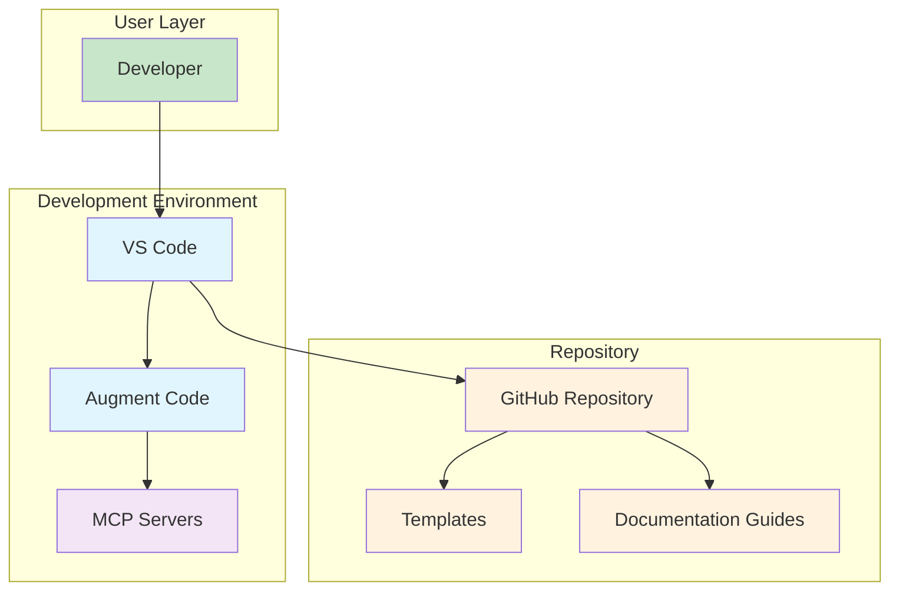

# Repository Setup Template & Style Guide

[](https://github.com/6r1zzlyB/repo_setup)
[](./LICENSE)
[](https://github.com/6r1zzlyB/repo_setup)
[](https://docs.github.com/en/contributing)

A personal repository setup template and style guide for creating well-organized, professional GitHub repositories. This template incorporates current GitHub best practices, modern development workflows, and consistent documentation standards for personal projects.

**Author:** Matt S
**Created:** 2025
**License:** All Rights Reserved (see [LICENSE](./LICENSE))

## 🎯 Overview

This repository serves as both a **template** and a **style guide** for my personal GitHub repositories. It provides:

- **📋 Complete Templates** - Ready-to-use templates for README, CHANGELOG, and project structure
- **📚 Personal Standards** - Consistent documentation and development setup across all projects
- **🛠️ GitHub Integration** - Streamlined workflows and repository organization
- **🎨 Modern Practices** - Aligned with current GitHub documentation best practices
- **🚀 Developer Experience** - Optimized for VS Code, Augment Code, and my preferred development tools

### Key Principles

- **User-Centered Design** - Content structured around user needs and goals
- **Scannable Format** - Easy to navigate with clear headings and visual hierarchy
- **Plain Language** - Clear, concise writing that's accessible to all skill levels
- **Consistent Structure** - Standardized organization across all documentation
- **Professional Presentation** - Enterprise-ready formatting and style

## 🗂️ Repository Structure

```text
repo_setup/
├── README.md                   # This comprehensive overview
├── LICENSE                     # License terms
├── CONTRIBUTING.md             # Contribution guidelines
├── CODE_OF_CONDUCT.md          # Community standards
├── SECURITY.md                 # Security policy
├── .github/                    # GitHub-specific files
│   ├── ISSUE_TEMPLATE/         # Issue templates
│   ├── PULL_REQUEST_TEMPLATE.md # PR template
│   └── workflows/              # GitHub Actions
├── templates/                  # Ready-to-use templates
│   ├── README_TEMPLATE.md      # Comprehensive README template
│   ├── CHANGELOG_TEMPLATE.md   # Changelog template
│   └── PROJECT_STRUCTURE.md    # Standard project layouts
├── guides/                     # Detailed documentation guides
│   ├── development-setup.md    # VS Code, Augment, MCP setup
│   ├── documentation-standards.md # README and changelog standards
│   └── repository-organization.md # GitHub repo best practices
└── examples/                   # Example implementations
    ├── sample-project/         # Complete example project
    └── workflows/              # Example GitHub Actions
```

## 🚀 Quick Start

### For New Personal Projects

1. **Copy Template Structure**

   ```bash
   # Create new repository directory
   mkdir my-new-project
   cd my-new-project

   # Copy templates from this repo
   cp ../repo_setup/templates/README_TEMPLATE.md README.md
   cp ../repo_setup/templates/CHANGELOG_TEMPLATE.md CHANGELOG.md
   ```

2. **Initialize Repository**

   ```bash
   # Initialize Git repository
   git init
   git add .
   git commit -m "feat: initial project setup from template"

   # Create GitHub repository and push
   gh repo create my-new-project --private
   git push -u origin main
   ```

3. **Set Up Development Environment**
   - Follow the [Development Setup Guide](guides/development-setup.md)
   - Configure VS Code with my standard extensions
   - Set up Augment Code and MCP servers

### For Existing Personal Projects

1. **Audit Current Structure**
   - Compare with [Repository Organization Guide](guides/repository-organization.md)
   - Identify missing files and documentation gaps
   - Note inconsistencies with personal standards

2. **Apply Standards Incrementally**
   - Update README.md using the template
   - Add missing essential files (LICENSE, .gitignore, etc.)
   - Standardize documentation format and style

3. **Enhance Repository Organization**
   - Reorganize files following standard structure
   - Update development environment configuration
   - Implement consistent naming conventions

## 📚 Documentation Standards

### Content Types

Following GitHub's documentation best practices, we use these content types:

- **📖 Conceptual** - Explains what something is and why it matters
- **📋 Referential** - Provides comprehensive details and specifications
- **📝 Procedural** - Step-by-step instructions for completing tasks
- **🔧 Troubleshooting** - Solutions for common problems and issues
- **⚡ Quickstart** - Fast path to get started quickly
- **🎓 Tutorial** - Learning-oriented, hands-on guidance

### Writing Principles

- **User-Centered** - Start with user needs and goals
- **Scannable** - Use headings, lists, and visual elements
- **Plain Language** - Clear, everyday words over jargon
- **Active Voice** - Direct, engaging writing style
- **Concise** - One idea per sentence and paragraph

## 🛠️ Features

### Templates & Examples

- **📄 README Template** - Comprehensive template with all essential sections
- **📊 Changelog Template** - Semantic versioning and standard format
- **🏗️ Project Structure** - Standard directory layouts for different project types
- **🔄 GitHub Workflows** - CI/CD templates and automation examples

### Development Tools Integration

- **🎨 VS Code Configuration** - Optimized settings and extensions
- **🤖 Augment Code Setup** - AI-powered development assistance
- **🔌 MCP Server Integration** - Context-aware development tools
- **🐙 GitHub Features** - Issues, PRs, Actions, and security features

### Documentation Standards

- **📝 Writing Guidelines** - Clear, consistent documentation style
- **🎨 Visual Standards** - Mermaid diagrams and formatting consistency
- **🔗 Cross-References** - Proper linking and navigation
- **♿ Accessibility** - Inclusive design and clear structure

## 📖 Available Guides

### Core Documentation

| Guide | Description | Use Case |
|-------|-------------|----------|
| [📋 Documentation Standards](guides/documentation-standards.md) | README, changelog, and visual documentation standards | Creating consistent, professional documentation |
| [🛠️ Development Setup](guides/development-setup.md) | VS Code, Augment Code, and MCP server configuration | Setting up modern development environment |
| [🏗️ Repository Organization](guides/repository-organization.md) | GitHub best practices and project structure | Organizing repositories professionally |

### Templates & Resources

| Template | Description | Use Case |
|----------|-------------|----------|
| [📄 README Template](templates/README_TEMPLATE.md) | Comprehensive README with all sections | Creating detailed project documentation |
| [📊 Changelog Template](templates/CHANGELOG_TEMPLATE.md) | Semantic versioning changelog format | Tracking project changes and releases |
| [🏗️ Project Structure](templates/PROJECT_STRUCTURE.md) | Standard directory layouts | Organizing code and files consistently |

## 🔧 Configuration

### Essential Files Checklist

Use this checklist to ensure your repository has all essential files:

#### Required Files

- [ ] `README.md` - Project overview and instructions
- [ ] `LICENSE` - Legal terms for code usage
- [ ] `.gitignore` - Files Git should ignore
- [ ] `CHANGELOG.md` - Version history and changes

#### Recommended Files

- [ ] `CONTRIBUTING.md` - Contributor guidelines
- [ ] `CODE_OF_CONDUCT.md` - Community standards
- [ ] `SECURITY.md` - Security policy and reporting
- [ ] `.github/ISSUE_TEMPLATE/` - Issue templates
- [ ] `.github/PULL_REQUEST_TEMPLATE.md` - PR template

#### Development Files

- [ ] `.vscode/settings.json` - VS Code workspace settings
- [ ] `.vscode/extensions.json` - Recommended extensions
- [ ] `.github/workflows/` - GitHub Actions workflows
- [ ] `requirements.txt` or `package.json` - Dependencies

### GitHub Repository Settings

#### Branch Protection (Recommended)

- Require pull request reviews before merging
- Require status checks to pass before merging
- Require branches to be up to date before merging
- Restrict pushes that create files over 100MB

#### Security Settings

- Enable vulnerability alerts
- Enable automated security fixes
- Enable Dependabot security updates
- Set up code scanning (if applicable)

## 🎨 Visual Documentation

### Mermaid Diagram Standards

This template includes comprehensive Mermaid diagram standards with consistent color schemes:

- **Input/Start**: `#c8e6c9` (light green)
- **Process/Action**: `#e1f5fe` (light blue)
- **Decision/Logic**: `#f3e5f5` (light purple)
- **Output/Storage**: `#fff3e0` (light orange)
- **Error/Warning**: `#ffcdd2` (light red)

### Example Architecture Diagram



## 🔄 Maintenance & Updates

### Keeping Templates Current

This repository is regularly updated to reflect:

- **🆕 New GitHub Features** - Latest GitHub capabilities and best practices
- **🛠️ Tool Updates** - VS Code extensions, Augment Code features, MCP servers
- **� Documentation Standards** - Evolving documentation and style practices
- **🎯 Personal Workflow** - Refinements based on real project experience

### Update Process

1. **Review Changes** - Regularly check for outdated information
2. **Test Updates** - Validate changes with current projects
3. **Update Templates** - Modify templates to reflect new standards
4. **Document Changes** - Update CHANGELOG.md with improvements

## 🔒 Security & Privacy

### Personal Repository Security

Since this is for personal repositories, security considerations include:

- **🔐 Private Repositories** - Keep sensitive projects private by default
- **🔑 Access Control** - Manage collaborator access carefully
- **📝 Sensitive Data** - Never commit secrets, API keys, or personal information
- **🛡️ Dependency Security** - Regularly update dependencies and monitor for vulnerabilities

### Best Practices

- Use `.env` files for environment variables (never commit them)
- Enable GitHub security alerts and Dependabot
- Review code before committing, especially in shared repositories
- Use GitHub's secret scanning and security advisories

## 📄 License

This repository setup template and style guide is proprietary software.

**All Rights Reserved** - See [LICENSE](LICENSE) file for complete terms.

**Author:** Matt S
**Repository:** [repo_setup](https://github.com/6r1zzlyB/repo_setup) (Private)

## 🙏 Acknowledgments

This template incorporates best practices and inspiration from:

- **GitHub Documentation Team** - For comprehensive documentation standards
- **GitHub Community** - For open source best practices and conventions
- **VS Code Team** - For development environment optimization
- **Augment Code** - For AI-powered development workflow integration

## 📞 Support

### Getting Help

1. **📖 Check the Guides** - Review documentation in the `guides/` directory
2. **🔍 Search Issues** - Look for similar questions or problems
3. **💬 Ask Questions** - Open an issue with the `question` label
4. **📧 Contact** - Reach out to the repository owner for complex issues

### Quick Links

- [📋 Documentation Standards](guides/documentation-standards.md)
- [🛠️ Development Setup](guides/development-setup.md)
- [🏗️ Repository Organization](guides/repository-organization.md)
- [📄 README Template](templates/README_TEMPLATE.md)
- [📊 Changelog Template](templates/CHANGELOG_TEMPLATE.md)

---

**💡 Pro Tip:** Start with the [Quick Start](#-quick-start) section above, then dive into the specific guides that match your needs. This template is designed to grow with your project - use what you need now and add more as your project evolves.

---

*Last updated: 2025 | This template follows current GitHub best practices and modern development standards.*
