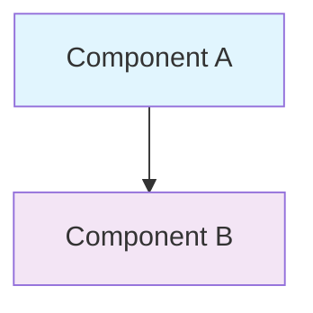
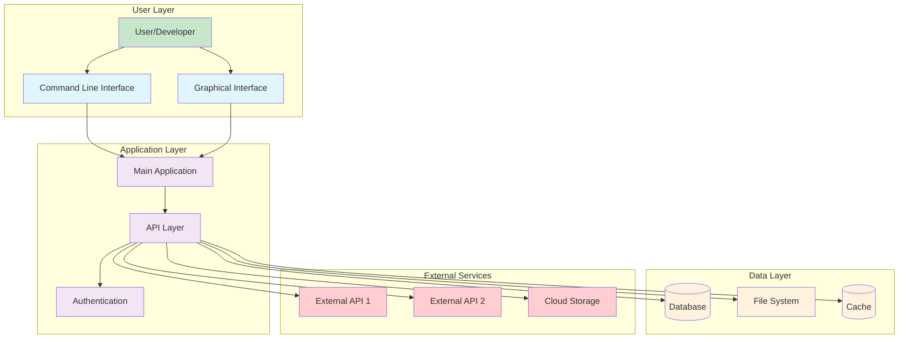
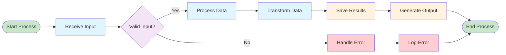
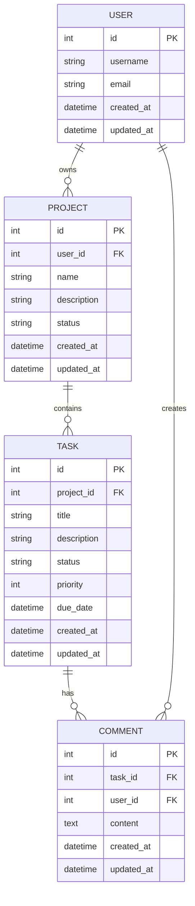
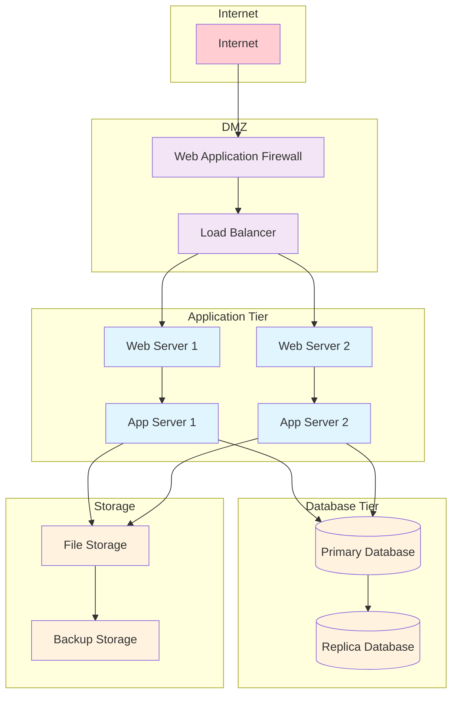

# Documentation Standards Guide

Comprehensive documentation standards for maintaining consistent README.md and CHANGELOG.md files across all personal repositories, including visual documentation standards with Mermaid diagrams.

**Author:** Matt S  
**Created:** 2025  
**License:** All Rights Reserved (see [../LICENSE](../LICENSE))

## 📋 Table of Contents

1. [Overview](#-overview)
2. [README.md Standards](#-readmemd-standards)
3. [CHANGELOG.md Standards](#-changelogmd-standards)
4. [Visual Documentation with Mermaid](#-visual-documentation-with-mermaid)
5. [Mermaid Diagram Examples](#-mermaid-diagram-examples)
6. [Implementation Guidelines](#-implementation-guidelines)
7. [Quality Assurance](#-quality-assurance)

## 🎯 Overview

This comprehensive style guide establishes standardized formatting, structure, and content organization for all README.md and CHANGELOG.md files throughout personal repositories. It ensures consistency, readability, maintainability, and professional presentation across all documentation.

### Key Principles

- **Consistency**: Uniform structure and formatting across all files
- **Clarity**: Clear, concise, and informative content
- **Maintainability**: Easy to update and extend
- **Professional**: Enterprise-ready documentation standards
- **Accessibility**: Readable by both technical and non-technical users
- **Visual Enhancement**: Comprehensive visual documentation with Mermaid diagrams

### Scope and Application

- **Personal Projects**: Standards apply to all personal repositories
- **Professional Presentation**: Suitable for portfolio and professional use
- **Cross-Platform**: Compatible with Windows, macOS, and Linux environments
- **Modern Standards**: Aligned with current GitHub best practices

## 📄 README.md Standards

### Header Structure

```markdown
# [Project Name]

[](link-to-technology-docs)
[](./LICENSE)
[](https://github.com/6r1zzlyB/[repository-name])

[One-line description of the project purpose and primary functionality]

**Author:** Matt S
**Created:** [Year]
**License:** All Rights Reserved (see [LICENSE](./LICENSE))
```

### Required Sections (in order)

1. **📋 Overview** - Comprehensive description of purpose and capabilities
2. **🛠️ Features** - Key features and functionality
3. **🚀 Getting Started** - Prerequisites, installation, and basic usage
4. **🔧 Configuration** - Configuration options and customization
5. **📊 Architecture & Diagrams** - Visual documentation using Mermaid diagrams (when applicable)
6. **📊 Usage Examples** - Practical examples and use cases
7. **🔒 Security Considerations** - Security requirements and best practices
8. **🛠️ Troubleshooting** - Common issues and solutions
9. **📄 License** - License information and footer

### Optional Sections

- **📞 Support** - Support information and contact details
- **🔗 Related Projects** - Cross-references to related repositories
- **📈 Performance** - Performance considerations and optimization
- **🧪 Testing** - Testing procedures and validation

### Technology Badges

```markdown
[](https://docs.microsoft.com/en-us/powershell/)
[](https://www.python.org/)
[](./LICENSE)
[](https://github.com/6r1zzlyB/[repository-name])
```

### Content Guidelines

#### Code Blocks

- Use language-specific syntax highlighting
- Include comments for complex operations
- Provide both basic and advanced examples
- Use consistent indentation (4 spaces)

#### Lists and Structure

- Use emoji icons for major sections (📋 📊 🛠️ 🚀 🔧 🔒)
- Use **bold** for emphasis on key terms
- Use `code formatting` for file names, commands, and technical terms
- Use numbered lists for sequential steps
- Use bullet points for feature lists

#### Cross-References

```markdown
- See [related project](../related-project/README.md) for additional functionality
- Refer to [LICENSE](./LICENSE) for licensing details
- Check [main repository](https://github.com/6r1zzlyB/repo_setup) for templates
```

## 📊 CHANGELOG.md Standards

### Header Structure

```markdown
# Changelog - [Project Name]

All notable changes to [Project Name] will be documented in this file.

The format is based on [Keep a Changelog](https://keepachangelog.com/en/1.0.0/),
and this project adheres to [Semantic Versioning](https://semver.org/spec/v2.0.0.html).
```

### Version Structure

```markdown
## [Unreleased]

### Planned

- Future features and improvements

## [X.Y.Z] - YYYY-MM-DD

### Added

- New features and functionality

### Changed

- Changes to existing functionality

### Fixed

- Bug fixes and corrections

### Removed

- Removed features or functionality

### Security

- Security-related changes and improvements
```

### Semantic Versioning Guidelines

- **MAJOR (X.0.0)**: Incompatible API changes or major functionality changes
- **MINOR (0.Y.0)**: New functionality added in a backwards-compatible manner
- **PATCH (0.0.Z)**: Backwards-compatible bug fixes

### Entry Format Standards

```markdown
- **Feature Name**: Description of the feature or change
- **Enhancement**: Specific improvement with context and impact
- **Fix**: Clear description of what was fixed and why
```

### Footer Structure

```markdown
---

**License:** All Rights Reserved - See [LICENSE](./LICENSE) file for details.
**Author:** Matt S
**Repository:** [Repository Name] (Private)
```

## 📊 Visual Documentation with Mermaid

### When to Include Diagrams

#### Required for Complex Projects

- System architecture with multiple components
- Multi-step workflows or processes
- Network topology and infrastructure
- Database relationships and data flow
- Deployment and CI/CD pipelines

#### Optional for Simple Projects

- Basic command-line utilities
- Single-function scripts
- Configuration-only tools

### Standard Color Scheme

- **Input/Start**: `#c8e6c9` (light green) - Entry points and initialization
- **Process/Action**: `#e1f5fe` (light blue) - Processing steps and actions
- **Decision/Logic**: `#f3e5f5` (light purple) - Decision points and logic
- **Output/Storage**: `#fff3e0` (light orange) - Data storage and outputs
- **Error/Warning**: `#ffcdd2` (light red) - Error states and warnings
- **External/Internet**: `#ffcdd2` (light red) - External systems and internet

### Diagram Syntax Standards

````markdown
# Always use mermaid language specification


# Include descriptive text before complex diagrams
The following diagram shows the system architecture:

```mermaid
[diagram code]
```

# Add explanatory text after diagrams when needed
**Key Components:** The architecture separates concerns between...
````

### Accessibility Guidelines

- Include descriptive text before complex diagrams
- Provide alternative text explanations for visual content
- Keep diagrams focused and readable (max 10-12 nodes)
- Use clear, descriptive labels avoiding technical jargon
- Break complex systems into multiple focused diagrams

## 📊 Mermaid Diagram Examples

### System Architecture Diagram



### Process Flow Diagram



### Deployment Pipeline Diagram

```mermaid
graph LR
    subgraph "Development"
        DEV[Developer]
        LOCAL[Local Environment]
    end

    subgraph "Version Control"
        GIT[Git Repository]
        PR[Pull Request]
    end

    subgraph "CI/CD Pipeline"
        BUILD[Build Process]
        TEST[Automated Tests]
        DEPLOY[Deployment]
    end

    subgraph "Environments"
        STAGING[Staging Environment]
        PROD[Production Environment]
    end

    DEV --> LOCAL
    LOCAL --> GIT
    GIT --> PR
    PR --> BUILD
    BUILD --> TEST
    TEST --> DEPLOY
    DEPLOY --> STAGING
    STAGING --> PROD

    style DEV fill:#c8e6c9
    style LOCAL fill:#e1f5fe
    style GIT fill:#e1f5fe
    style PR fill:#f3e5f5
    style BUILD fill:#f3e5f5
    style TEST fill:#f3e5f5
    style DEPLOY fill:#f3e5f5
    style STAGING fill:#fff3e0
    style PROD fill:#fff3e0
```



### Database Relationship Diagram



### Network Architecture Diagram



## 📋 Implementation Guidelines

### File Organization

#### README.md Placement

- Always in repository root directory
- Named exactly `README.md` (case-sensitive)
- UTF-8 encoding with LF line endings
- Maximum line length of 120 characters

#### CHANGELOG.md Placement

- Always in repository root directory
- Named exactly `CHANGELOG.md` (case-sensitive)
- UTF-8 encoding with LF line endings
- Chronological order (newest entries first)

### Content Maintenance

#### Regular Updates

- Update README.md when adding new features
- Update CHANGELOG.md for every release
- Review and update diagrams when architecture changes
- Verify all links and references quarterly

#### Version Control Integration

- Include documentation updates in feature branches
- Review documentation changes in pull requests
- Tag documentation versions with software releases
- Maintain documentation history in version control

### Quality Assurance

#### Automated Checks

```bash
# Markdown linting
markdownlint README.md CHANGELOG.md

# Link checking
markdown-link-check README.md CHANGELOG.md

# Spell checking
cspell "*.md"
```

#### Manual Review Checklist

- [ ] All required sections present and complete
- [ ] Consistent formatting and style
- [ ] Working links and references
- [ ] Accurate and up-to-date information
- [ ] Proper grammar and spelling
- [ ] Appropriate use of visual elements
- [ ] Mermaid diagrams render correctly
- [ ] Cross-references are accurate

---

**License:** All Rights Reserved - See [../LICENSE](../LICENSE) file for details.

**Author:** Matt S
**Repository:** [repo_setup](https://github.com/6r1zzlyB/repo_setup) (Private)
