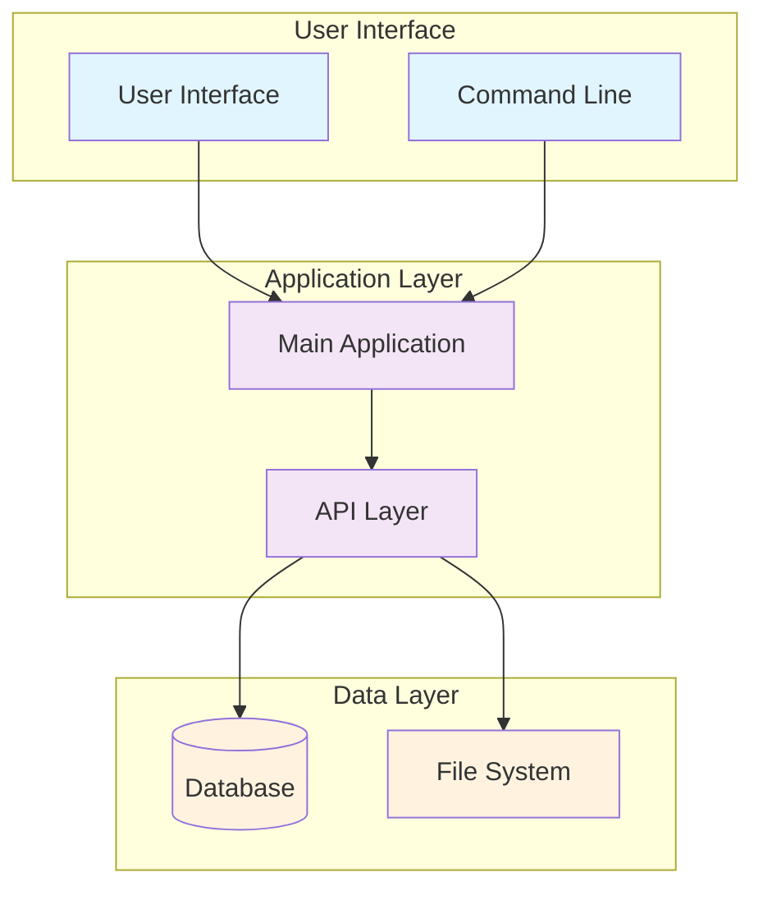
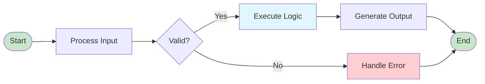

# [Project Name]

[](link-to-technology-docs)
[](./LICENSE)
[](https://github.com/6r1zzlyB/[repository-name])

[One-line description of the project purpose and primary functionality]

**Author:** Matt S  
**Created:** [Year]  
**License:** All Rights Reserved (see [LICENSE](./LICENSE))

## 📋 Overview

[Comprehensive description of the project purpose, capabilities, and use cases. Include:]

- **Primary Purpose**: What this project does
- **Key Capabilities**: Main features and functionality
- **Target Use Cases**: Intended scenarios and applications
- **Technology Stack**: Main technologies and frameworks used
- **Project Status**: Current development stage and stability

## 🛠️ Features

### Core Features

- **Feature 1**: Description of feature and its benefits
- **Feature 2**: Description of feature and its benefits
- **Feature 3**: Description of feature and its benefits

### Additional Capabilities

- **Advanced Feature 1**: Description of advanced functionality
- **Advanced Feature 2**: Description of advanced functionality
- **Integration Support**: External services and APIs supported

## 🚀 Getting Started

### Prerequisites

#### System Requirements

- **[Technology] [Version]+** with [specific requirements]
- **Operating System**: Windows 10+, macOS 10.15+, or Linux
- **Memory**: Minimum 4GB RAM recommended
- **Storage**: [Required disk space]

#### Dependencies

```bash
# Install required dependencies
[installation commands]

# Verify installation
[verification commands]
```

### Installation

#### Quick Setup

```bash
# Clone the repository
git clone https://github.com/6r1zzlyB/[repository-name].git
cd [repository-name]

# Install dependencies
[dependency installation commands]

# Run initial setup
[setup commands]
```

#### Configuration

1. **Environment Setup**
   ```bash
   # Copy environment template
   cp .env.example .env
   
   # Edit configuration
   nano .env
   ```

2. **Required Configuration**
   - Set `API_KEY` to your API key
   - Configure `DATABASE_URL` if using database
   - Update `PORT` if needed (default: 3000)

### Usage

#### Basic Usage

```[language]
# Basic usage example
[basic command/script execution]

# Expected output:
[output description]
```

#### Advanced Usage

```[language]
# Advanced usage with options
[advanced command with parameters]

# Configuration example
[configuration code/settings]
```

## 🔧 Configuration

### Environment Variables

| Variable | Description | Default | Required |
|----------|-------------|---------|----------|
| `API_KEY` | API authentication key | - | Yes |
| `PORT` | Server port number | 3000 | No |
| `DEBUG` | Enable debug logging | false | No |

### Configuration Files

#### Main Configuration (`config.yml`)

```yaml
# Application settings
app:
  name: [project-name]
  version: 1.0.0
  environment: development

# Feature toggles
features:
  feature1: true
  feature2: false
```

## 📊 Architecture & Diagrams

### System Architecture



### Process Flow



## 📊 Usage Examples

### Example 1: Basic Operation

```[language]
# Description of what this example demonstrates
[example code]

# Expected result:
[expected output or behavior]
```

### Example 2: Advanced Configuration

```[language]
# Description of advanced usage scenario
[advanced example code]

# This example shows:
# - Advanced feature usage
# - Configuration options
# - Error handling
```

## 🔒 Security Considerations

### Data Protection

- **Input Validation**: All user inputs are validated and sanitized
- **Authentication**: [Authentication method used]
- **Authorization**: [Authorization approach]
- **Data Encryption**: [Encryption methods for sensitive data]

### Best Practices

- Keep dependencies updated
- Use environment variables for sensitive configuration
- Enable logging for security events
- Regular security audits and updates

## 🛠️ Troubleshooting

### Common Issues

#### Issue 1: [Common Problem]

**Symptoms:**
- [Description of symptoms]
- [Error messages or behaviors]

**Solution:**
```bash
# Steps to resolve the issue
[solution commands or configuration changes]
```

#### Issue 2: [Another Common Problem]

**Symptoms:**
- [Description of symptoms]

**Solution:**
- [Step-by-step resolution]
- [Alternative approaches if needed]

### Getting Help

1. **Check Logs** - Review application logs for error details
2. **Verify Configuration** - Ensure all settings are correct
3. **Update Dependencies** - Make sure all packages are current
4. **Contact Support** - Reach out if issues persist

## 📈 Performance

### Performance Characteristics

- **Response Time**: [Typical response times]
- **Throughput**: [Requests per second or similar metrics]
- **Resource Usage**: [Memory and CPU requirements]
- **Scalability**: [Scaling considerations]

### Optimization Tips

- [Performance optimization suggestions]
- [Configuration tuning recommendations]
- [Monitoring and profiling guidance]

## 🧪 Testing

### Running Tests

```bash
# Run all tests
[test command]

# Run specific test suite
[specific test command]

# Generate coverage report
[coverage command]
```

### Test Coverage

- Unit Tests: [Coverage percentage]
- Integration Tests: [Coverage percentage]
- End-to-End Tests: [Coverage percentage]

## 📄 License

All Rights Reserved - See [LICENSE](./LICENSE) file for details.

**Author:** Matt S  
**Repository:** [Repository Name] (Private)

---

**Note:** This is a template file. Replace all bracketed placeholders with actual content specific to your project.
